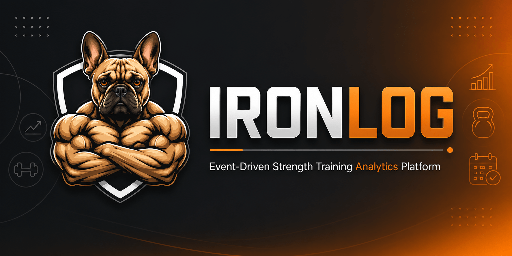
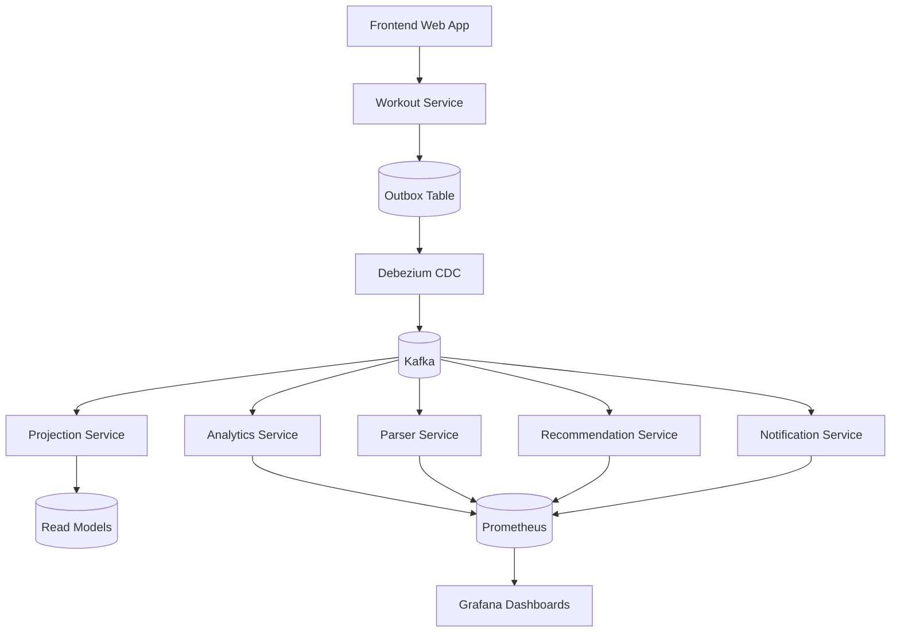
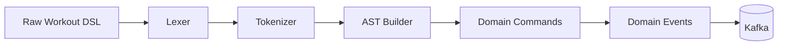
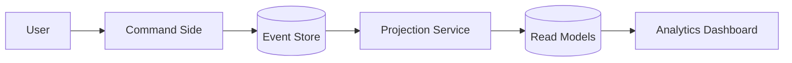
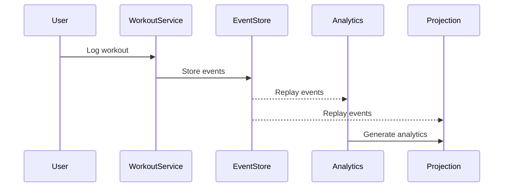
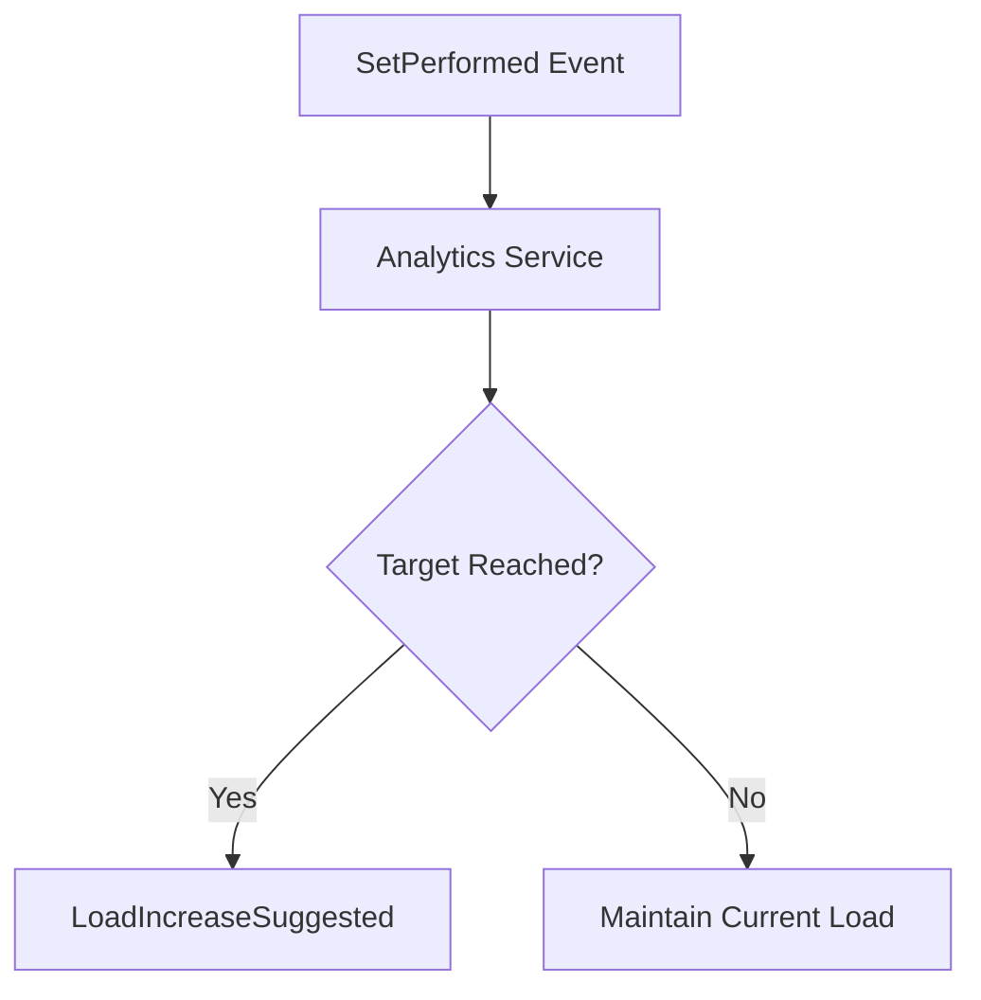

# IRONLOG - Event-Driven Strength Training Analytics Platform


IRONLOG is an event-driven platform designed to track strength training sessions through a custom workout DSL, event sourcing and temporal analytics.

The project focuses on one core idea:

> transform raw textual workout logs into structured event streams, performance analytics and progression insights.

IRONLOG is not a simple fitness CRUD.

It was built to demonstrate practical applications of:

- Event-Driven Architecture
- Event Sourcing
- CQRS
- Domain-Driven Design
- DSL Parsing
- Temporal Analytics
- Observability
- Distributed Systems concepts

---

## 🎯 Motivation

Most workout apps introduce too much friction:

- too many clicks
- too many forms
- slow logging
- poor progression tracking

IRONLOG follows a different philosophy.

The system introduces a **power-user workout DSL** inspired by real-world raw training notes.

Example:

```txt
SUPINO RETO BARRA

Warm up: 1x 1-20 10kg (10)
Feeder: 1x 08-10 15kg (10)
Work: 2x 08-10 20kg (6 8)
Top set: 1x 6-8 25kg (3)
```

Instead of manually filling forms, users can write workouts naturally while the platform:

- parses the DSL
- builds domain structures
- emits events
- calculates analytics
- tracks progression
- generates projections

---

## 🧠 Core Concepts

### 📨 Event-Driven Architecture

IRONLOG is fully event-driven.

Services communicate exclusively through Kafka events.

There are NO direct HTTP calls between services.

Example flow:

```txt
WorkoutLogged
↓
Parser Service
↓
WorkoutParsed
↓
Analytics Service
↓
PerformanceImproved
↓
Recommendation Service
↓
LoadIncreaseSuggested
```

---

### 🧩 Event Sourcing

The system stores workout history as immutable events.

Example:

```txt
WorkoutStarted
ExerciseStarted
SetPerformed
SetPerformed
WorkoutFinished
```

This allows:

- full workout reconstruction
- event replay
- projection rebuilding
- analytics recalculation
- historical timeline generation

---

### ⚖️ CQRS

IRONLOG separates:

#### Write side

Responsible for:

- commands
- validation
- event generation

#### Read side

Responsible for:

- dashboards
- progression charts
- projections
- optimized queries

---

### 🧠 Workout DSL

One of the main goals of the project is implementing a custom DSL (Domain Specific Language) for workout tracking.

Example:

```txt
Work: 2x 08-10 20kg (6 8)
```

Semantic meaning:

| Part | Meaning |
|---|---|
| Work | set type |
| 2x | planned sets |
| 08-10 | target rep range |
| 20kg | weight |
| (6 8) | executed reps |

The parser converts this into a structured AST and domain commands.

---

## 🏗️ System Architecture



---

## 🧱 Architectural Principles

- Event-Driven Architecture
- Event Sourcing
- CQRS
- Clean Architecture
- Hexagonal Architecture
- Outbox Pattern
- CDC with Debezium
- Eventual Consistency
- Idempotency
- Observability-first design

---

## ⚙️ Tech Stack

### Backend

- Golang
- PostgreSQL
- Redis
- Apache Kafka
- Debezium

### Frontend

- React
- Vite
- TailwindCSS
- Recharts

### Observability

- Prometheus
- Grafana
- OpenTelemetry

---

## 🤖 AI-Assisted Development

This project was built using modern AI-Assisted Software Development practices.

| | |
|---|---|
| IDE/Agent | VSCode with Github Copilot |
| Main Model | Claude Haiku 4.5 |
| Strategic Support | ChatGPT (GPT-5.5) (architectural decisions) |
| Methodology | Spec-Driven Development (SDD) |

Development was conducted from formal specifications (Specs), following a **Spec-Driven Development** approach, where each functionality is planned, documented, and validated before implementation.

### 📋 Project Specifications

IRONLOG's functionality was planned and organized through formal specification documents located in `/docs`, containing:

- **ARCHITECTURE.md** - System design patterns (Event Sourcing, CQRS, DDD, Hexagonal Architecture)
- **DSL_SPEC.md** - Complete DSL grammar (EBNF notation, lexer/parser pipeline, examples)
- **SERVICE_COMMUNICATION.md** - Event contracts and data flows between 6 microservices
- **PROJECT_STRUCTURE.md** - Directory organization, naming conventions, development patterns
- **DEVELOPMENT_GUIDE.md** - Step-by-step guide with practical example (adding a new metric)

Each specification clearly defines the **"what"** before implementation begins, ensuring consistent architecture and quality.

### 📚 Documentation

The `/docs` folder contains comprehensive, ordered documentation:

1. **[QUICKSTART.md](docs/QUICKSTART.md)** (5 min) - Setup and first run
   - Docker Compose and local development options
   - Testing the DSL parser
   - Accessing observability tools

2. **[ARCHITECTURE.md](docs/ARCHITECTURE.md)** (30 min) - System design
   - Event-Driven Architecture fundamentals
   - Event Sourcing and CQRS patterns
   - Service responsibilities and ownership
   - Technology selection rationale

3. **[PROJECT_STRUCTURE.md](docs/PROJECT_STRUCTURE.md)** (20 min) - Codebase navigation
   - Directory layout and organization
   - Hexagonal architecture in each service
   - Shared code and conventions
   - Naming patterns for files and identifiers

4. **[SERVICE_COMMUNICATION.md](docs/SERVICE_COMMUNICATION.md)** (30 min) - Event flows
   - EventEnvelope contract specification
   - 6 services: publishers, consumers, event types
   - Communication patterns (request-response, async, pipelines)
   - Kafka topics and idempotency strategy

5. **[DSL_SPEC.md](docs/DSL_SPEC.md)** (20 min) - Workout language
   - Complete EBNF grammar
   - Lexical tokens and parsing process
   - Practical examples with AST output
   - Variations and edge cases

6. **[DEVELOPMENT_GUIDE.md](docs/DEVELOPMENT_GUIDE.md)** (2h) - Building features
   - 10-step practical example: adding a strength progression metric
   - Domain → Application → Ports → Adapters pattern
   - Writing tests at each layer
   - Debugging tips and best practices

7. **[E2E_TEST_GUIDE.md](docs/E2E_TEST_GUIDE.md)** (30 min) - Manual testing
   - Step-by-step verification of all 13 components
   - Health checks for each service
   - DSL parser testing
   - Database and Kafka inspection

8. **[DEPLOYMENT_DOCKER.md](docs/DEPLOYMENT_DOCKER.md)** (20 min) - Docker operations
   - Docker Compose configuration and ports
   - Service startup, logs, and health checks
   - Database migrations and backup
   - Performance tuning and resource limits

9. **[TROUBLESHOOTING.md](docs/TROUBLESHOOTING.md)** (on-demand) - Common issues
   - Container startup failures
   - Database connection problems
   - Kafka message flow issues
   - Service communication and API errors
   - Frontend connectivity and build issues

**Total learning time: ~5 hours** to understand the full system architecture and start contributing.

---

## 📂 Monorepo Structure

```txt
/ironlog
├── backend/
│   ├── services/
│   │   ├── workout-service/
│   │   ├── parser-service/
│   │   ├── analytics-service/
│   │   ├── projection-service/
│   │   ├── recommendation-service/
│   │   └── notification-service/
│   │
│   └── shared/
│       ├── events/
│       ├── contracts/
│       ├── infra/
│       └── database/
│
├── frontend/
│   └── web-app/
│
├── infra/
│   ├── kafka/
│   ├── postgres/
│   ├── redis/
│   ├── prometheus/
│   ├── grafana/
│   └── debezium/
│
└── README.md
```

---

## 🧩 Workout DSL Grammar

The workout DSL follows a predictable semantic structure.

```txt
ExerciseName

SetType: Setsx RepRange Weight (ExecutedReps)
```

---

## 🧠 Parser Pipeline



---

## ⚖️ CQRS Flow



---

## 🧩 Event Sourcing Replay



---

## 📈 Automatic Progression Detection



---

## 📦 Outbox Pattern

IRONLOG uses the Outbox Pattern for reliable event publishing.

Rules:

- services NEVER publish directly to Kafka
- events are persisted into an outbox table
- Debezium publishes events asynchronously

---

## 📊 Observability

All services expose:

```txt
/metrics
```

Metrics include:

- events_processed_total
- errors_total
- parsing_success_total
- progression_detected_total
- personal_records_total

---

## 🚀 Future Ideas

- mobile app
- wearable integrations
- AI-generated training insights
- automatic fatigue analysis
- smart progression engine
- voice-based workout logging

---

## 📜 License

MIT License
